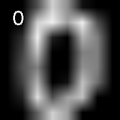
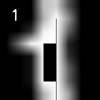
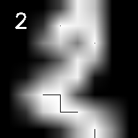
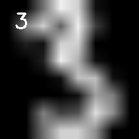
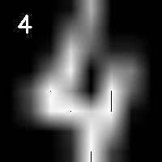
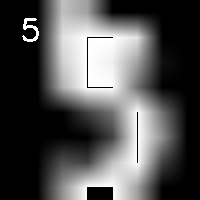

# 🔢 Handwritten Digits Classification using Logistic Regression

A beginner-friendly Machine Learning project that classifies handwritten digits using the Scikit-learn Digits dataset and a Logistic Regression model.

This project demonstrates a complete Machine Learning workflow including data preprocessing, model training, evaluation, saving results, and displaying sample images using OpenCV.

> ⚠️ This repository is part of my Machine Learning learning journey and will be continuously improved with more advanced models and techniques.

---

## 📌 Features

- Load the Scikit-learn Digits dataset
- Display sample digit images using OpenCV
- Split the dataset into training and testing sets
- Standardize the data using StandardScaler
- Train a Logistic Regression classifier
- Evaluate model performance
- Save classification accuracy to a text file
- Save sample digit images automatically

---

## 📂 Project Structure

```text
digit-classification/
│
├── main.py
├── README.md
├── requirements.txt
├── .gitignore
│
├── images/
│   ├── sample_digit_0.png
│   ├── sample_digit_1.png
│   └── ...
│
└── results/
    └── results.txt
```

---

## 🛠 Technologies Used

- Python
- OpenCV
- Scikit-learn

---

## 🚀 How to Run

Clone the repository

```bash
git clone https://github.com/YourUsername/digit-classification.git
```

Install dependencies

```bash
pip install -r requirements.txt
```

Run

```bash
python main.py
```

---

# 🖼 Sample Images

<table>
<tr>
<td align="center">

### Digit 0



</td>

<td align="center">

### Digit 1



</td>

<td align="center">

### Digit 2



</td>

</tr>

<tr>
<td align="center">

### Digit 3



</td>

<td align="center">

### Digit 4



</td>

<td align="center">

### Digit 5



</td>

</tr>

</table>

---

## 📈 Result

Model Accuracy

```text
97.22%
```

The accuracy is automatically saved inside:

```text
results/results.txt
```

---

## 🎯 Future Improvements

This project will be updated with more advanced Machine Learning techniques, including:

- Decision Tree
- Random Forest
- Support Vector Machine (SVM)
- K-Nearest Neighbors (KNN)
- Neural Networks
- Hyperparameter Tuning
- Cross Validation
- Confusion Matrix Visualization
- Model Comparison

---

## 📖 What I Learned

Through this project I practiced:

- Machine Learning workflow
- Data preprocessing
- StandardScaler
- Logistic Regression
- Train/Test Split
- Model Evaluation
- Working with OpenCV
- Writing modular Python code

---

## ⭐ Repository Goal

This repository is part of my AI & Machine Learning portfolio.
Each future update will improve the project by applying more advanced algorithms, cleaner code structure, and better evaluation techniques.
